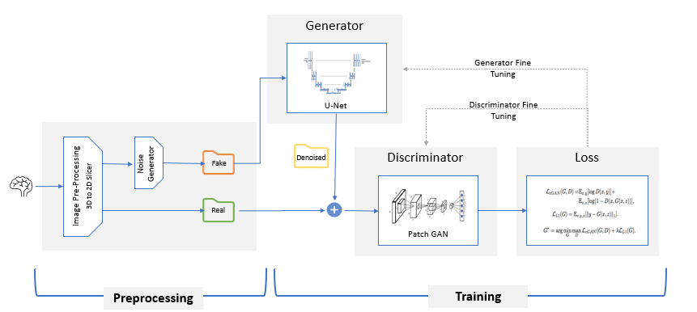
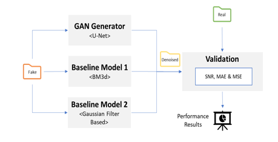
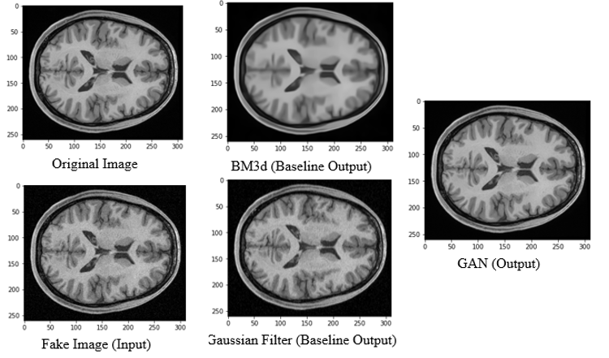
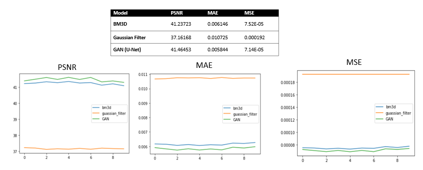

# MRI Denoising with GANs (CS 598 DL Project)

## Abstract

The goal of this course project is to explore the potential of state-of-the-art Deep Learning in addressing practical problems of Magnetic Resonance Imaging (MRI). MRI is one of the most important modern medical imaging technologies given its capability in probing rich set of biological information in vivo. However, MRI still suffers from several issues that impede its practical utility, including low signal-to-noise ratio (SNR) and limited spatial resolution. In this project, we have investigated the possibility of using Generative Adversarial Networks based architecture to improve the sensitivity & resolution of MRI images and further compare its performance with traditional techniques BM3D & Gaussian Filter.

## Training & Validation Pipeline
Model Training & Validation pipeline is composed of below three stages: 

1. **Data Pre-Processing** – 2D noiseless MRI images are sliced from original 3D data and noisy 2D images are generated by adding noise to the original ones.
2. **Model Training** – setup & train a GAN based deep learning architecture with generator & discriminator components for image denoising tasks.  
3. **Model Validation** – trained generator model is used to generate denoised MRI images by passing noisy counterparts; results are compared with baseline models.

## Model Architecture
The architecture contains two components:  Generator and Discriminator. The generator takes the degraded image as the input and tries to produce the improved image that is as close to the ground truth image as possible. The discriminator is a component that distinguish whether an image comes from the real training data or generated from the generator. These two components essentially play a zero-sum game: the generator tries to fool the discriminator by generating as real images as possible, while the discriminator provides important critiques (or feedbacks) to the generator to push it improve its parameters.



### Generator
U-Net model is configured as generator, given its capability in extracting multi-scale image features. It is a CNN based encoder-decoder model for image translation where skip connections are used to connect layers in the encoder with corresponding layers in the decoder that have the same sized feature maps. This method is extensively used for biomedical image segmentation problems. This method uses data augmentation to annotate the sample data more efficiently.

### Discriminator
PatchGAN based discriminator which takes decision based on patches of images. Image is first divided into NxN parts and each part is classified. A convolution map is scanned over these NxN patches and then it averages responses to provide the classification result.

### Validation
To evaluate the performance of the deep model, we compare with the traditional image denoising methods such as Gaussian filter-based method and BM3d. 



## Project Setup
Please see [Colab page](https://colab.research.google.com/drive/1JQ7rJShfHBGl-DF3VG9ujV62y774dAYg?usp=sharing) for the end-to-end implementation and evaluation workflow

Below are implementation instructions:
1. For the GANs model
   
    a. The data (inputs/targets) are at the directory `cs598_dl_project/project_model/MPRAGE_recon_UNet`.
    
    b. The **Unet** implementation details are at `project_model/models/networks.py`, class Unet. (the model implementation is within `pix2pix_model.py`, as consistent with the original pix2pix project)
    
    c. To train the model-
   ```python
    project_model/train.py --help
    project_model/train.py
    
   #To run without GPUs
    train.py --gpu_ids -1
   ```
    d. To test the model-
   ```python
    project_model/test.py --help
    project_model/test.py
   
    #To run without GPUs
    test.py --gpu_ids -1
   ```
2. The baseline models are implemented at `model_implementation_comparison.py`. The parameter optimization functions are included at `bm3d_demos/bm3d_param_selection.py` for BM3D model, and `guassian_param_selection.py` for Guanssian Filter model.
3. The evaluation of the baseline and GANs model is included in model_implementation_comparison.py, over 10 test object.

## Results
Below is a sample visual representation of output generated by different denoising techniques. It can be visually noticed that GANs output are almost similar to original input. 


We compared the performance between the baseline models (BM3D), Gaussian Filter and GAN on 10 test images, with performance measured by PSNR, MAE, MSE. The results are as follows:


## Acknowledgments
Other than the customization above, the code borrowed from:
1. [Pix2Pix](https://github.com/phillipi/pix2pix), for the GAN architecture reference.
2. [BM3D](https://pypi.org/project/bm3d/), for the BM3D reference
3. BM3D implementation heavily referenced from https://github.com/JeffOwOSun/gpu-bm3d.
